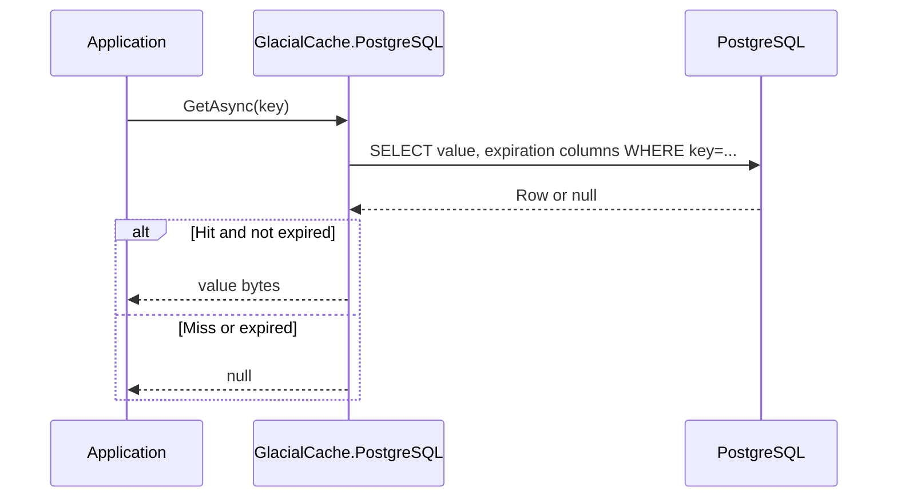

## ❄️ GlacialCache

**PostgreSQL-backed distributed caching for .NET** — reuse the database you already trust to get durable, cross-instance caching without adding new infrastructure.

<p>
  <a href="docs/getting-started.md"><strong>🚀 Quick Start</strong></a>
  &nbsp;•&nbsp;
  <a href="docs"><strong>📖 Full Documentation</strong></a>
  &nbsp;•&nbsp;
  <a href="examples"><strong>💡 Runnable Examples</strong></a>
  &nbsp;•&nbsp;
  <a href="https://github.com/leonibr/glacial-cache/stargazers"><strong>⭐ Star on GitHub</strong></a>
</p>

<p>
  <!-- Badges use placeholder values; update once published/configured -->
  
  <a href="https://github.com/leonibr/glacial-cache/actions/workflows/ci.yml"></a>
  
  
</p>

---

### Why GlacialCache❓

- **Reuse PostgreSQL, skip new infra**: No Redis cluster to deploy or operate — GlacialCache rides on top of the PostgreSQL you already run.
- **Drop-in `IDistributedCache`**: Works with standard ASP.NET Core patterns while also exposing richer APIs when you need them.
- **Durable, cross-instance cache**: Entries are stored in PostgreSQL and shared across all app instances, surviving restarts and deployments.
- **Production-ready**: Background cleanup, manager election, resilience policies, and structured logging are built in from day one.
- **Cost-effective**: Ideal when PostgreSQL has spare capacity and you want powerful caching without another bill or moving part.

---

### What you get

- **Core features**

  - ✅ Drop-in replacement for `IDistributedCache`
  - ✅ Absolute, sliding, and combined expiration
  - ✅ Efficient storage of strings, byte arrays, and complex objects
  - ✅ Single, well-indexed PostgreSQL table

- **Performance & reliability**

  - ⚡ Async-first pipeline with Npgsql connection pooling
  - ⚡ Optimized SQL for hot-path operations and cleanup
  - 🛡️ Resilience policies and robust error handling
  - 🧹 Background maintenance loop that keeps the cache table healthy

- **Enterprise & cloud**

  - ☁️ Azure Managed Identity support for passwordless connections
  - 📊 Rich logging for operations, maintenance, and elections
  - 🔐 Configurable timeouts, pooling, and resilience

- **Developer experience**
  - 🧩 Simple registration via `AddGlacialCachePostgreSQL(...)`
  - 🧪 Ready-to-run examples and integration tests
  - 🔧 Pluggable serializers (MemoryPack or JSON bytes)

---

### Quick start in 3 steps

1. **Install the package** (placeholder name — update once published):

   ```bash
   dotnet add package GlacialCache.PostgreSQL
   ```

2. **Register GlacialCache in `Program.cs`:**

   ```csharp
   using GlacialCache.PostgreSQL;

   var builder = WebApplication.CreateBuilder(args);

   builder.Services.AddGlacialCachePostgreSQL(
       "Host=localhost;Database=myapp;Username=postgres;Password=mypassword");

   var app = builder.Build();
   ```

3. **Use `IDistributedCache` as usual:**

   ```csharp
   public class ProductService
   {
       private readonly IDistributedCache _cache;

       public ProductService(IDistributedCache cache)
       {
           _cache = cache;
       }

       public async Task<Product?> GetProductAsync(int id)
       {
           var key = $"product:{id}";

           var cached = await _cache.GetStringAsync(key);
           if (cached is not null)
           {
               return JsonSerializer.Deserialize<Product>(cached);
           }

           var product = await _repository.GetProductAsync(id);
           if (product is null)
           {
               return null;
           }

           var json = JsonSerializer.Serialize(product);
           await _cache.SetStringAsync(
               key,
               json,
               new DistributedCacheEntryOptions
               {
                   AbsoluteExpirationRelativeToNow = TimeSpan.FromHours(1),
                   SlidingExpiration = TimeSpan.FromMinutes(15)
               });

           return product;
       }
   }
   ```

---

### GlacialCache vs other options

| Scenario / Feature            | GlacialCache.PostgreSQL                             | `IMemoryCache`                       | Redis-based cache                                    |
| ----------------------------- | --------------------------------------------------- | ------------------------------------ | ---------------------------------------------------- |
| Storage location              | PostgreSQL table                                    | Application process memory           | Dedicated Redis instance/cluster                     |
| Shared across instances       | ✅ Yes                                              | ❌ No                                | ✅ Yes                                               |
| Survives restarts/deployments | ✅ Yes                                              | ❌ No                                | ⚠️ Depends on configuration                          |
| Extra infrastructure required | ❌ No (uses existing PostgreSQL)                    | ❌ No                                | ✅ Yes (Redis server or managed service)             |
| Latency                       | Network + DB round-trip                             | In-process (fastest)                 | Network hop to Redis                                 |
| Operational complexity        | Low (reuses existing DB ops practices)              | Low                                  | Medium–high (cluster, scaling, failover)             |
| Best when…                    | You already run PostgreSQL and want durable caching | Single-instance or ephemeral caching | You need ultra-high throughput and large cache sizes |

More details in **[`docs/concepts.md`](docs/concepts.md)**.

---

### How it works (at a glance)



Read more about the architecture in **[`docs/architecture.md`](docs/architecture.md)**.

---

### Performance & use cases

- **Benchmarks**: See `src/GlacialCache.Benchmarks` and the reports under `BenchmarkDotNet.Artifacts/results` for throughput and latency comparisons.
- **Typical workloads**: API response caching, product/catalog data, configuration blobs, and other read-heavy data that benefits from cross-instance caching.
- **When to choose GlacialCache**: You already operate PostgreSQL, your cache size fits within its capacity, and you want fewer moving parts than a dedicated cache cluster.

---

### Packages

- **Core cache provider**: `src/GlacialCache.PostgreSQL`
- **Benchmarks**: `src/GlacialCache.Benchmarks`
- **Tests**: `tests/GlacialCache.PostgreSQL.Tests`
- **Examples**: `examples/` (console, Web API, MemoryPack, CacheEntry, etc.)

### Documentation hub

Use these guides to go from first install to production tuning:

- **Getting started**: `docs/getting-started.md` — minimal ASP.NET Core quick start with `Program.cs`.
- **Concepts**: `docs/concepts.md` — data model, expiration behavior, cleanup strategy, and comparisons.
- **Configuration**: `docs/configuration.md` — `GlacialCachePostgreSQLOptions` and all related sections.
- **Architecture**: `docs/architecture.md` — components, background maintenance, connection management.
- **Troubleshooting**: `docs/troubleshooting.md` — common issues and concrete resolutions.

The package-level README in `src/GlacialCache.PostgreSQL/README.md` provides an overview, schema reference, and usage examples.

### Examples

See `examples/README.md` for runnable samples:

- Basic console usage
- Advanced `CacheEntry` patterns
- MemoryPack serialization
- ASP.NET Core Web API integration with Swagger

### Contributing & community

Issues and pull requests are welcome.

- **Before contributing**: run the tests from `tests/GlacialCache.PostgreSQL.Tests` and keep documentation in `docs/` up to date with behavioral changes.
- **How to contribute**: fork the repo, create a feature branch, and open a PR with a clear description and rationale.
- **Support the project**: if GlacialCache helps you, consider starring the repository and sharing it with your team.

---

### License

GlacialCache is open source software licensed under the **MIT License**.  
See the `LICENSE` file for details.
