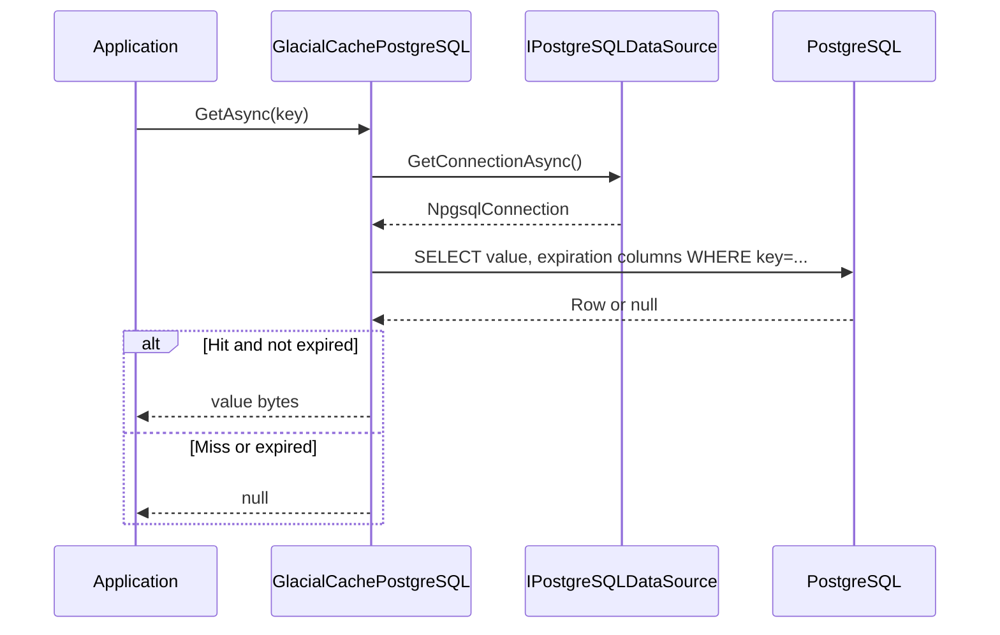
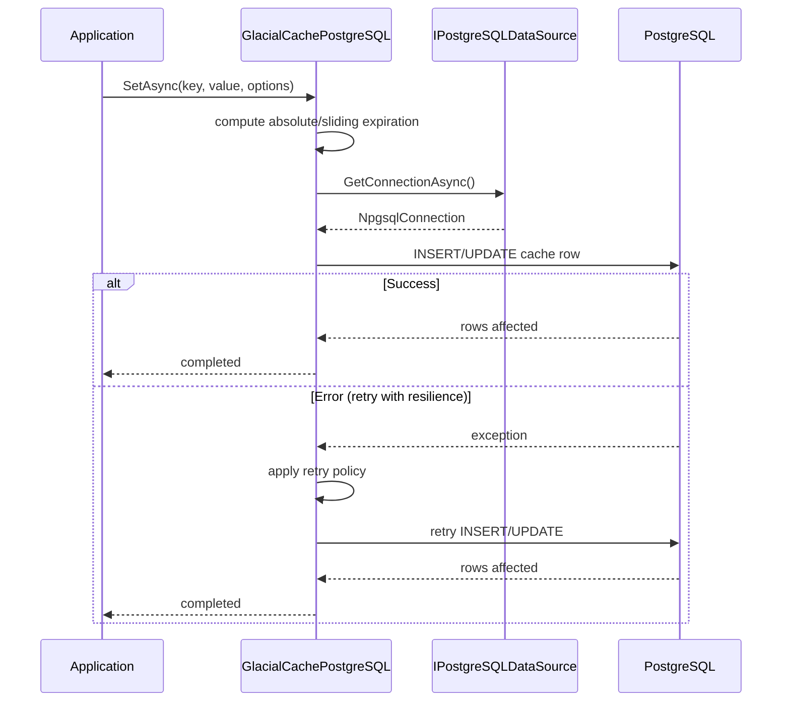
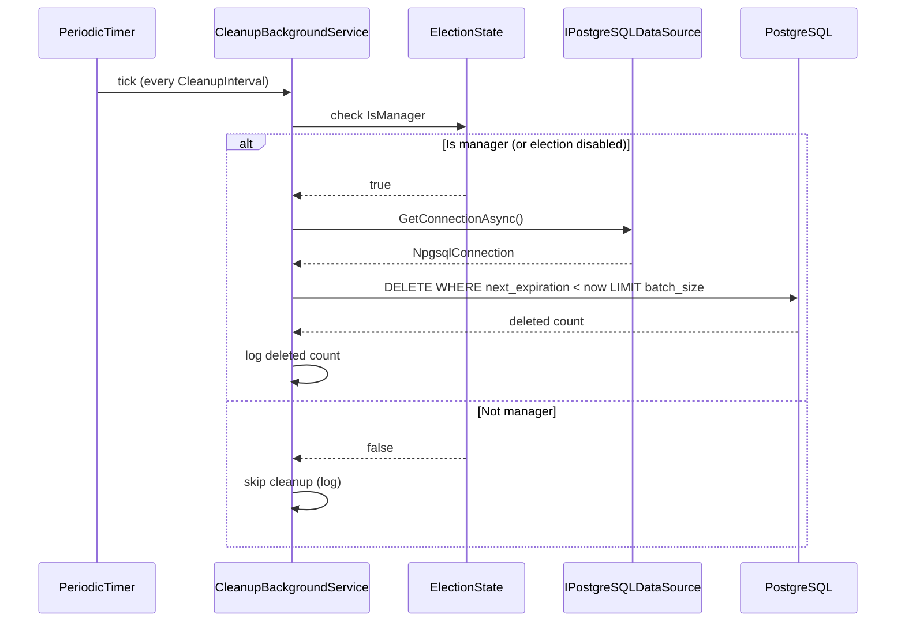

## Architecture

This page describes the high-level architecture of GlacialCache.PostgreSQL: major components, how requests flow through the system, how background maintenance works, and how connections are managed.

### Main components

- **Public cache API**

  - `GlacialCachePostgreSQL` implements both `IDistributedCache` and `IGlacialCache`.
  - Registered into DI via `AddGlacialCachePostgreSQL(...)` in `ServiceCollectionExtensions`.
  - Exposed as:
    - `IDistributedCache` for standard ASP.NET Core patterns.
    - `IGlacialCache` for extended APIs (batch operations, rich `CacheEntry` model).

- **Configuration & options**

  - `GlacialCachePostgreSQLOptions` and sub-options (`Connection`, `Cache`, `Maintenance`, `Resilience`, `Infrastructure`, `Security`, `Monitoring`) define behavior.
  - Validated at startup to catch misconfigurations early.

- **Database abstraction**

  - `IPostgreSQLDataSource` wraps Npgsql data source / connection pooling.
  - `IDbNomenclature` computes table, schema, and index names.
  - `IDbRawCommands` exposes SQL used for cache operations and cleanup.

- **Serialization**

  - `ICacheEntrySerializer` abstracts value serialization.
  - Default implementations:
    - `MemoryPackCacheEntrySerializer` (binary, fastest).
    - `JsonCacheEntrySerializer` (UTF-8 JSON).
  - `GlacialCacheEntryFactory` assembles `CacheEntry<T>` instances with metadata.

- **Background services**
  - `ElectionBackgroundService` + `ElectionState` + `LockOptions`: coordinate a single manager for distributed tasks using advisory locks.
  - `CleanupBackgroundService`: periodically deletes expired cache entries (`MaintenanceOptions`).

---

## Request flow

At a high level, a `GetAsync` or `SetAsync` call flows like this:



For writes:



For cleanup (background maintenance):



Key points:

- Cache operations are fully async and use connection pooling via `IPostgreSQLDataSource`.
- Expiration columns (`absolute_expiration`, `sliding_interval`, `next_expiration`) are maintained on each write.
- Reads are as lean as possible: a simple `SELECT` plus expiration logic in the cache layer.
- Resilience policies wrap operations to handle transient failures gracefully.
- Cleanup runs independently in the background, coordinated via manager election.

---

## Background maintenance

### Manager election

When `Infrastructure.EnableManagerElection` is `true` (default), GlacialCache coordinates a single “manager” instance to run background tasks:

- `ElectionBackgroundService` runs in each instance.
- It uses PostgreSQL advisory locks (`LockOptions`) to acquire leadership.
- Leadership state is tracked in `ElectionState`.
- If the current manager fails, another instance can take over based on backoff and jitter rules.

For simple single-instance or development environments you can set:

```csharp
options.Infrastructure.EnableManagerElection = false;
```

This effectively treats each instance as independent; in many dev setups you will just have one instance anyway.

### Cleanup background service

`CleanupBackgroundService` is registered as:

- A singleton service created with `GlacialCachePostgreSQLOptions`, `IPostgreSQLDataSource`, `IDbRawCommands`, `ElectionState`, and `TimeProvider`.
- A hosted service only when `Maintenance.EnableAutomaticCleanup` is `true`.

Behavior:

- Uses a `PeriodicTimer` configured with `Maintenance.CleanupInterval`.
- On each tick:
  - Checks manager-election state (if enabled) and skips work if the instance is not the manager.
  - Obtains a pooled connection from `IPostgreSQLDataSource`.
  - Executes `CleanupExpiredSql` using the current time from `TimeProvider`.
  - Logs how many rows were deleted.
- Errors are caught and logged; a failed cleanup run will simply be retried on the next tick.

This design keeps cleanup **off** the hot path of `Get`/`Set` calls while still reclaiming space and maintaining index health.

---

## Connection management

Connections are managed centrally by `PostgreSQLDataSource` (through `IPostgreSQLDataSource`):

- Uses Npgsql’s built-in pooling.
- Pool size and pruning behavior are configured via `Connection.Pool`.
- Timeouts for acquiring connections and running commands are governed by `Connection.Timeouts` and resilience policies.

Benefits:

- All parts of the library (cache operations, maintenance, election) share the same data source instance.
- Pool sizing and timeouts can be tuned in one place.
- Logging hooks provide visibility into pool and connection behavior.

---

## Resilience and logging

GlacialCache integrates with Polly (via `IPolicyFactory`) and `Microsoft.Extensions.Logging`:

- **Resilience**

  - Retries, timeouts, and circuit-breaking are configured via `ResilienceOptions`.
  - Policies wrap database operations so transient failures are retried and systemic failures are short-circuited.

- **Logging**
  - Structured logging is used across:
    - Core cache operations.
    - Schema management (`SchemaManager`).
    - Manager election and cleanup services.
  - Log levels:
    - Information: successful operations, maintenance summaries.
    - Warning: non-critical anomalies (e.g., clamped expirations, recoverable errors).
    - Error: critical issues that likely need operator attention.

This combination gives you a robust, observable cache layer that behaves well under normal conditions and degrades gracefully under failure.
