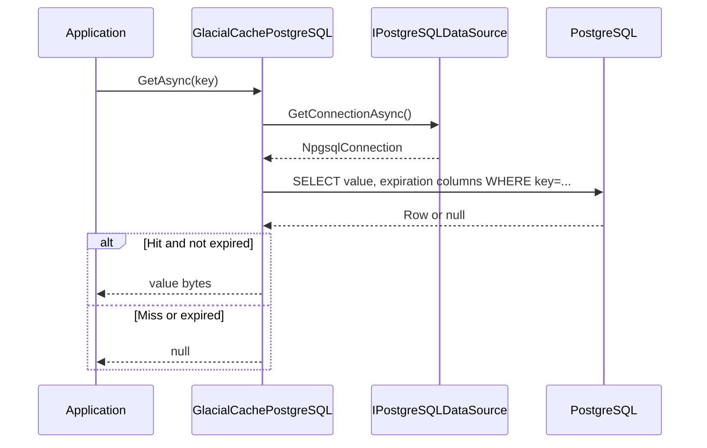
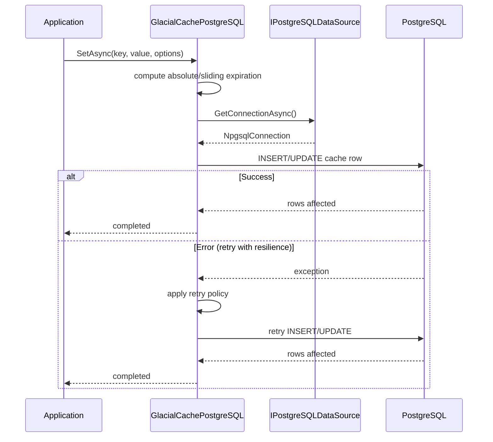
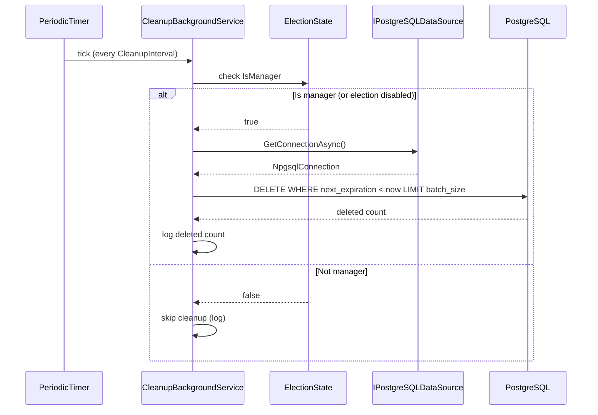

## Architecture

This page describes the shared GlacialCache architecture and the PostgreSQL provider's database and maintenance components.

### Main components

- **Public cache API**

  - PostgreSQL implements the canonical `GlacialCache.Abstractions.IGlacialCache` and `IDistributedCache`.
  - Registered into DI via `AddGlacialCachePostgreSQL(...)` in `ServiceCollectionExtensions`.
  - Exposed as:
    - `IDistributedCache` for standard ASP.NET Core patterns.
    - `IGlacialCache` for extended APIs (batch operations, rich `CacheEntry` model).

- **Configuration & options**

  - `GlacialCachePostgreSQLOptions` and sub-options (`Connection`, `Cache`, `Maintenance`, `Resilience`, `Infrastructure`, `Security`, `Monitoring`) define behavior.
  - Validated at startup to catch misconfigurations early.

- **Database abstraction**

  - `IPostgreSQLDataSource` wraps Npgsql data source / connection pooling.
  - `IDbNomenclature` computes table, schema, and index names.
  - `IDbRawCommands` exposes SQL used for cache operations and cleanup.

- **Serialization**

  - `ICacheEntrySerializer`, `CacheEntryFactory`, `CacheEntry<T>`, and the full `IGlacialCache` contract live in the shared `GlacialCache` package.
  - Default implementations:
    - `MemoryPackCacheEntrySerializer` (binary, fastest).
    - `JsonCacheEntrySerializer` (UTF-8 JSON).
  - The PostgreSQL `CacheEntryHelper` is a thin compatibility facade over the shared `CacheEntryFactory`.

- **Cache Entry Factory**

  - `CacheEntryFactory` creates and deserializes `CacheEntry<T>` instances for every provider
  - Abstracts serialization strategy from cache operations
  - Handles type information and metadata injection
  - Enables unit testing with mock entries

- **Time Management**

  - `TimeProvider` abstraction for testable time operations
  - `ITimeConverterService` handles absolute/relative time conversions
  - Ensures consistent UTC time handling across operations
  - Supports custom time providers for testing

- **Background services**
  - `ElectionBackgroundService` + `ElectionState` + `LockOptions`: coordinate a single manager for distributed tasks using advisory locks.
  - `CleanupBackgroundService`: periodically deletes expired cache entries (`MaintenanceOptions`).

---

## Request flow

At a high level, a `GetAsync` or `SetAsync` call flows like this:


```mermaid
sequenceDiagram
    participant App as Application
    participant Cache as GlacialCachePostgreSQL
    participant DS as IPostgreSQLDataSource
    participant PG as PostgreSQL

    App->>Cache: GetAsync(key)
    Cache->>DS: GetConnectionAsync()
    DS-->>Cache: NpgsqlConnection
    Cache->>PG: SELECT value, expiration columns WHERE key=...
    PG-->>Cache: Row or null
    alt Hit and not expired
        Cache-->>App: value bytes
    else Miss or expired
        Cache-->>App: null
    end
```

For writes:


```mermaid
sequenceDiagram
    participant App as Application
    participant Cache as GlacialCachePostgreSQL
    participant DS as IPostgreSQLDataSource
    participant PG as PostgreSQL

    App->>Cache: SetAsync(key, value, options)
    Cache->>Cache: compute absolute/sliding expiration
    Cache->>DS: GetConnectionAsync()
    DS-->>Cache: NpgsqlConnection
    Cache->>PG: INSERT/UPDATE cache row
    alt Success
        PG-->>Cache: rows affected
        Cache-->>App: completed
    else Error (retry with resilience)
        PG-->>Cache: exception
        Cache->>Cache: apply retry policy
        Cache->>PG: retry INSERT/UPDATE
        PG-->>Cache: rows affected
        Cache-->>App: completed
    end
```

For cleanup (background maintenance):


```mermaid
sequenceDiagram
    participant Timer as PeriodicTimer
    participant Cleanup as CleanupBackgroundService
    participant Election as ElectionState
    participant DS as IPostgreSQLDataSource
    participant PG as PostgreSQL

    Timer->>Cleanup: tick (every CleanupInterval)
    Cleanup->>Election: check IsManager
    alt Is manager (or election disabled)
        Election-->>Cleanup: true
        Cleanup->>DS: GetConnectionAsync()
        DS-->>Cleanup: NpgsqlConnection
        Cleanup->>PG: DELETE WHERE next_expiration < now LIMIT batch_size
        PG-->>Cleanup: deleted count
        Cleanup->>Cleanup: log deleted count
    else Not manager
        Election-->>Cleanup: false
        Cleanup->>Cleanup: skip cleanup (log)
    end
```

Key points:

- Cache operations are fully async and use connection pooling via `IPostgreSQLDataSource`.
- Expiration columns (`absolute_expiration`, `sliding_interval`, `next_expiration`) are maintained on each write.
- Reads are as lean as possible: a simple `SELECT` plus expiration logic in the cache layer.
- Resilience policies wrap operations to handle transient failures gracefully.
- Cleanup runs independently in the background, coordinated via manager election.

---

## Background maintenance

### Manager election

When `Infrastructure.EnableManagerElection` is `true` (default), GlacialCache coordinates a single “manager” instance to run background tasks:

- `ElectionBackgroundService` runs in each instance.
- It uses PostgreSQL advisory locks (`LockOptions`) to acquire leadership.
- Leadership state is tracked in `ElectionState`.
- If the current manager fails, another instance can take over based on backoff and jitter rules.

For simple single-instance or development environments you can set:

```csharp
options.Infrastructure.EnableManagerElection = false;
```

This effectively treats each instance as independent; in many dev setups you will just have one instance anyway.

### Cleanup background service

`CleanupBackgroundService` is registered as:

- A singleton service created with `GlacialCachePostgreSQLOptions`, `IPostgreSQLDataSource`, `IDbRawCommands`, `ElectionState`, and `TimeProvider`.
- A hosted service only when `Maintenance.EnableAutomaticCleanup` is `true`.

Behavior:

- Uses a `PeriodicTimer` configured with `Maintenance.CleanupInterval`.
- On each tick:
  - Checks manager-election state (if enabled) and skips work if the instance is not the manager.
  - Obtains a pooled connection from `IPostgreSQLDataSource`.
  - Executes `CleanupExpiredSql` using the current time from `TimeProvider`.
  - Logs how many rows were deleted.
- Errors are caught and logged; a failed cleanup run will simply be retried on the next tick.

This design keeps cleanup **off** the hot path of `Get`/`Set` calls while still reclaiming space and maintaining index health.

---

## Connection management

Connections are managed centrally by `PostgreSQLDataSource` (through `IPostgreSQLDataSource`):

- Uses Npgsql’s built-in pooling.
- Pool size and pruning behavior are configured via `Connection.Pool`.
- Timeouts for acquiring connections and running commands are governed by `Connection.Timeouts` and resilience policies.

Benefits:

- All parts of the library (cache operations, maintenance, election) share the same data source instance.
- Pool sizing and timeouts can be tuned in one place.
- Logging hooks provide visibility into pool and connection behavior.

---

## Resilience and logging

GlacialCache integrates with Polly (via `IPolicyFactory`) and `Microsoft.Extensions.Logging`:

- **Resilience**

  - Retries, timeouts, and circuit-breaking are configured via `ResilienceOptions`.
  - Policies wrap database operations so transient failures are retried and systemic failures are short-circuited.

- **Logging**
  - Structured logging is used across:
    - Core cache operations.
    - Schema management (`SchemaManager`).
    - Manager election and cleanup services.
  - Log levels:
    - Information: successful operations, maintenance summaries.
    - Warning: non-critical anomalies (e.g., clamped expirations, recoverable errors).
    - Error: critical issues that likely need operator attention.

This combination gives you a robust, observable cache layer that behaves well under normal conditions and degrades gracefully under failure.

---

## Batch Operation Optimizations

### Automatic Chunking

For large batch operations (>1000 items), GlacialCache automatically chunks requests to prevent:

- Memory pressure from large transactions
- Lock contention on the cache table
- Network timeout issues

**Implementation**:

```csharp
// User code - single call
await cache.SetMultipleAsync(largeDict); // 5000 items

// GlacialCache automatically:
// 1. Detects size > 1000 threshold
// 2. Splits into chunks of 500 items
// 3. Processes chunks sequentially
// 4. Logs chunk processing
```

**Configuration**:

- Maximum batch size: 1000 items (hardcoded threshold)
- Chunk size: 500 items per transaction
- No configuration needed - automatic

### Direct-memory batch writes

`SetMultipleAsync` snapshots `ReadOnlyMemory<byte>` payloads before PostgreSQL executes the batch. This is the recommended default when callers may reuse or release their buffers while the operation is running.

Use `SetMultipleDirectAsync` only when avoiding those payload copies is important. Direct-memory payloads remain caller-owned, so every backing buffer must stay alive, immutable, and undisposed until the returned task completes. This requirement also applies when the operation is canceled or fails, and for every chunk of batches larger than 1000 entries.

The recommended pattern is to keep ownership in scope and await the write before releasing it:

```csharp
using var owner = MemoryPool<byte>.Shared.Rent(payloadLength);
FillPayload(owner.Memory.Span[..payloadLength]);

var entries = new Dictionary<string, (ReadOnlyMemory<byte>, DistributedCacheEntryOptions)>
{
    ["cache-key"] = (owner.Memory[..payloadLength], new DistributedCacheEntryOptions())
};

await cache.SetMultipleDirectAsync(entries, cancellationToken);
// The owner can be disposed or returned to its pool after the await completes.
```

Do not start the write and release or reuse the buffer before awaiting it. The optimization eliminates explicit application payload copies; it does not claim that Npgsql or PostgreSQL performs end-to-end zero-copy I/O.

**Performance Benefits**:

- Prevents PostgreSQL statement size limits
- Reduces transaction duration
- Improves concurrency for other operations
- Better memory management

### Batch SQL Optimization

Batch operations use PostgreSQL's native batching:

```csharp
// Single database round-trip for multiple operations
await using var batch = new NpgsqlBatch(connection);
foreach (var entry in entries)
{
    var cmd = new NpgsqlBatchCommand(sql);
    cmd.Parameters.AddWithValue(...);
    batch.BatchCommands.Add(cmd);
}
await batch.ExecuteNonQueryAsync();
```

This is significantly faster than individual operations:

- **GetMultipleAsync**: ~10x faster than N individual Gets
- **SetMultipleAsync**: ~15x faster than N individual Sets
- **RemoveMultipleAsync**: ~20x faster than N individual Removes
